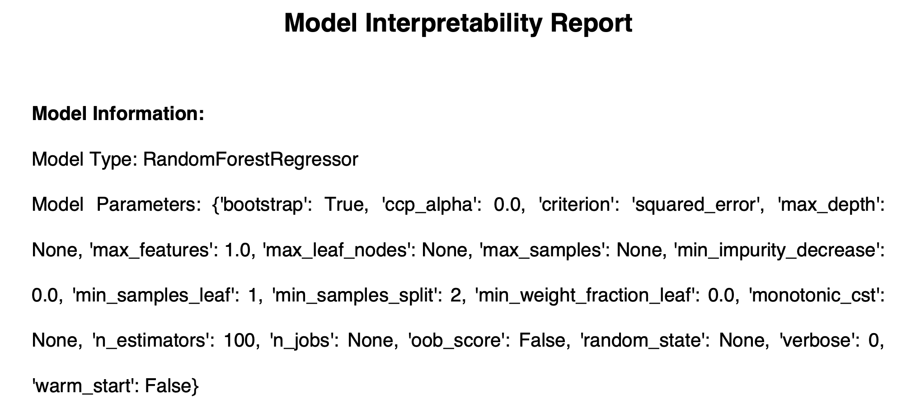
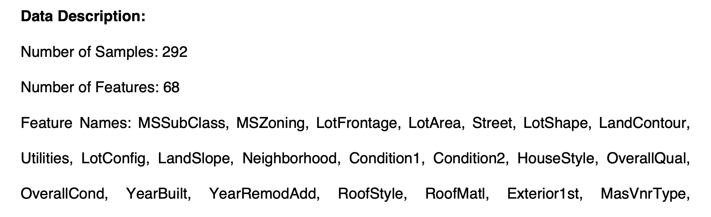
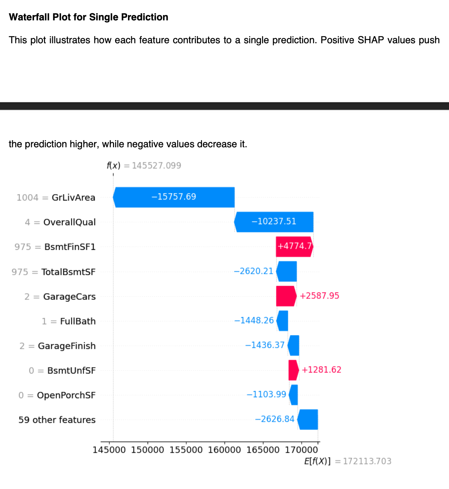
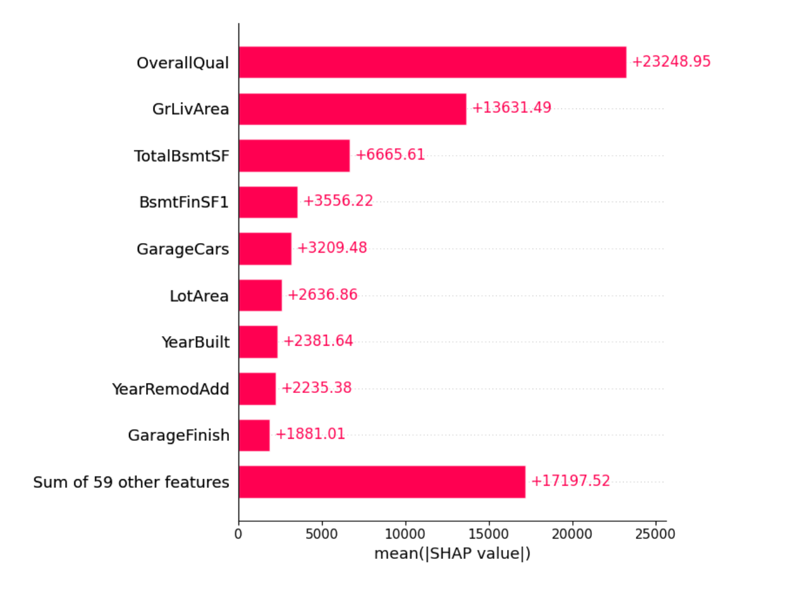

# InSightML
InSightML is an end-to-end toolkit designed to help data scientists, ML practitioners and even other domain experts interpret machine learning models. It takes a machine learning model file as input and provides a pdf report containing model information, data information, and plots derived from SHAP values. Please refer to the webapp https://insightmlmodels.streamlit.app/ to generate a quick report for your ML models. 

## Features

- **Report Generation**: Generate a pdf report for the machine learning model
- **Model Information**: Extracts and displays detailed information about the machine learning model.
- **Data Information**: Provides insights into the data used by the model.
- **SHAP Plots**: Generates plots based on SHAP values to explain model predictions.

## Supported models
The library supports all kind of machine learning models and the following file extensions:
1. .pkl (pickle files)
2. .h5 or .keras (keras files)
3. .pth files (pytorch files)

## Installation

To install the required dependencies, run:

```bash
pip install -r requirements.txt
```

## Usage

To use InSightML, run the following commands:

```bash
from src.model_loader import ModelLoaderFactory
from src.shap_explainer import ShapExplainerContext
from src.report_generator import PDFReportGenerator

loader = ModelLoaderFactory.get_model_loader("model_path")
model = loader.load_model("model_path")

Explainer = ShapExplainerContext(model, data)
shap_values = Explainer.explain_model()

report = PDFReportGenerator(model, data, shap_values, output_path="output_path")
report.generate_pdf_report()

```

Replace `model_path` with the path to your machine learning model file, and data with pandas dataframe object.

## Example

Please see examples of execution of code in "notebooks/ReportGeneration.ipynb".

Here is an example of the **automated report generated** by InSightML:


*Model information*


*Data information*


*SHAP-based waterfall plot*


*SHAP-based feature importance visualization*

For the full report, check out [this sample PDF](reports/model_deep_interpretability_report.pdf).


## Contributing

Contributions are welcome! Please open an issue or submit a pull request.

## License

This project is licensed under the MIT License. See the [LICENSE](LICENSE) file for details.

## Contact

For any questions or inquiries, please contact [Shivansh Chhawri](mailto:shivanshchhawri@example.com).
